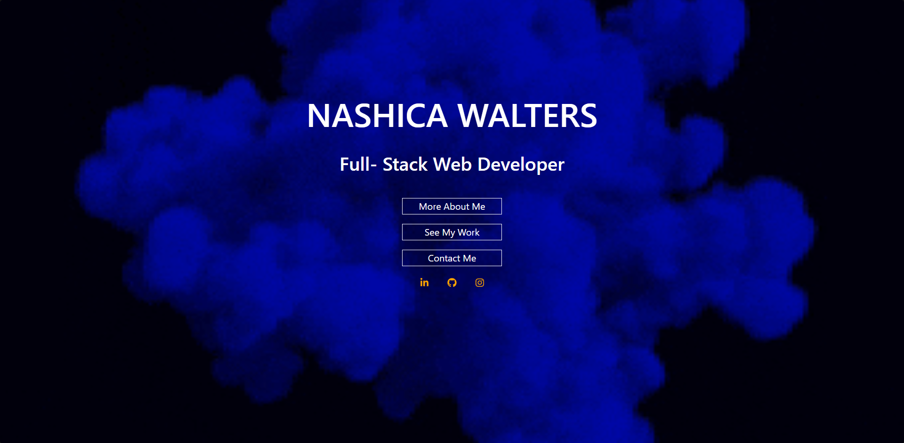
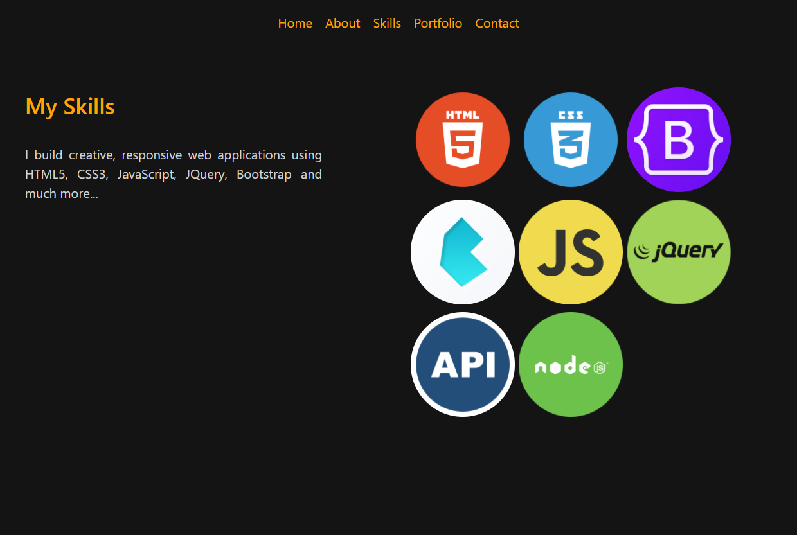
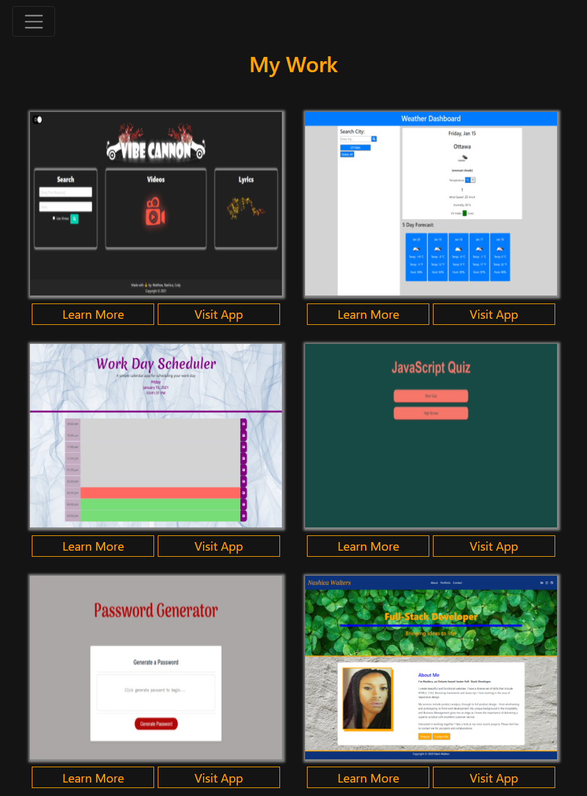
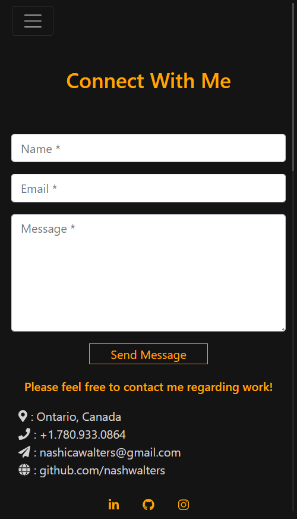

# Portfolio

This project is my responsive designed portfolio. 

## Table of Contents
* [General Information](#general-information)
* [Technology](#technology)
* [Installation](#installation)
* [Screenshots](#screenshots)
* [Credits](#credits)
* [Contact](#contact)
* [License](#license)

## General Information

This is my updated portfolio. It’s important because it provides a place to not only list my experience, but to show my experience and contextualize it in greater detail than a resume with bullet points would allow. As I gain experience, learn new skills, and create new projects, my portfolio will be growing with me. 

The new features added are:
* Downloadable resume - A button was added in the About section that opens a pdf version on my resume in a new window.
* A skills section - A skills section was added to showcase the technology and frameworks that I have learnt and implemented.

In addtion links to my deployed portfolio and github pages have been added to my linkedin profile in the contact section.

## Technology

This is a simple portfolio using:
* HTML5
* CSS3
* Boostrap CDN - including jQuery plugin.

## Deployment

* Github page: [https://nashwalters.github.io/portfolio/](https://nashwalters.github.io/portfolio/)

* To open in a new window, copy and paste: http://nashwalters.github.io/portfolio/

#### View my first portfolio
* Github page: [https://nashwalters.github.io/rmd-portfolio/](https://nashwalters.github.io/rmd-portfolio/)

## Screenshots

 

#### Click on the arrow to dropdown images at various screen sizes.

  
Website at 992px

  

  
Website at 768px

   

  
Website at 400px

   

## Credits

* Carleton University Coding Bootcamp team
* [Adam Simonini](https://github.com/adamsimonini)

## Contact

Nash Walters- nash.walters@outlook.com

## License 

Copyright © 2021 Nash Walters
